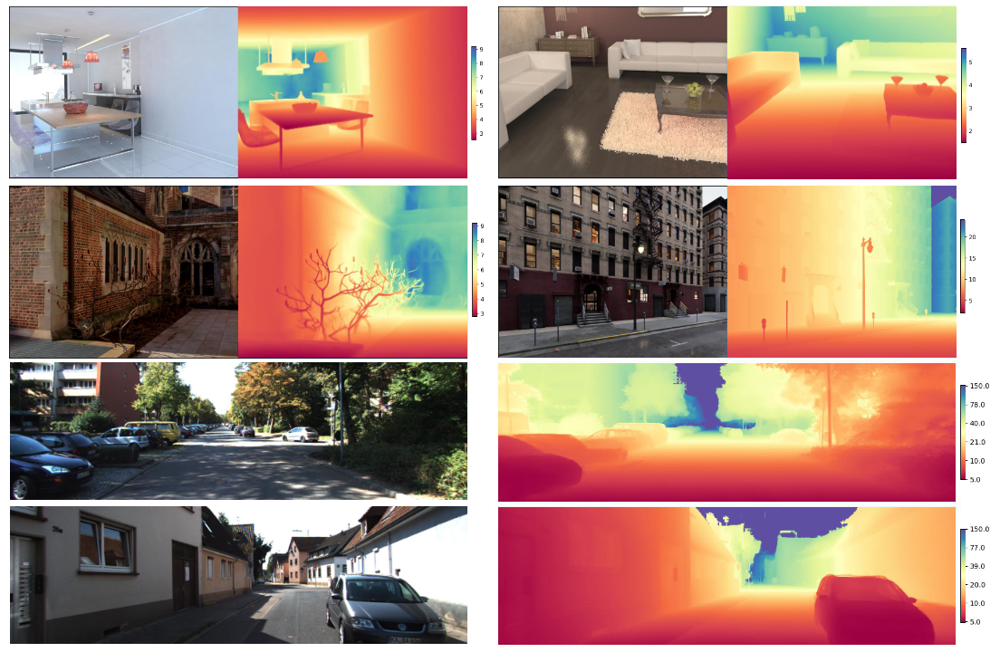

# Metric-Solver: Sliding Anchored Metric Depth Estimation from a Single Image

In this paper, we introduce Metric-Solver, a novel sliding anchor-based metric depth estimation method that dynamically adapts to varying scene scales.



Accurate metric depth estimation is vital for many vision tasks but remains challenging due to varying depth scales across scenes. We propose Metric-Solver, a sliding anchor-based method that adaptively normalizes depth into two components: scaled near-field and tapered far-field. A reference depth anchor dynamically adjusts along the depth axis—smaller anchors enhance near-field precision, while larger ones improve far-field estimation. This unified and adaptive representation handles depths from zero to infinity without manual scale tuning. Experiments show Metric-Solver achieves superior accuracy and cross-dataset generalization compared to existing methods.

## [Project page](https://tele-ai.github.io/MetricSolver/) |  [Paper](https://arxiv.org/abs/2504.12103)

Code is coming soon.


## Citation

If you find Metric-Solver useful for your work please cite:
```
@article{wen2025metricsolver
  author    = {Tao Wen and Jiepeng Wang and Yabo Chen and Shugong Xu and Chi Zhang and Xuelong Li},
  title     = {Metric-Solver: Sliding Anchored Metric Depth Estimation from a Single Image},
  journal   = {arXiv preprint arXiv:2504.12103},
  year      = {2025},
}
```